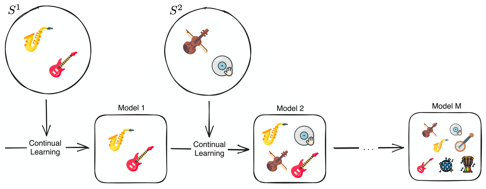

<p align='center'>
  <a href='https://praig.ua.es/'></a>
</p>

<h1 align='center'>Continual Learning for Music Classification</h1>

<p align='center'>
  
  
  
</p>

<p align='center'>
  <a href='#abstract'>Abstract</a> •
  <a href='#project-setup'>Project Setup</a> •
  <a href='#data'>Data</a> •
  <a href='#run-experiments'>Run Experiments</a> •
  <a href='#license'>License</a>
</p>

## Updates
- Usage instructions included!
- The paper was accepted at **[ISMIR 2024](https://ismir2024.ismir.net/)**!

## Abstract

Music classification is a prominent research area within Music Information Retrieval. While Deep Learning methods can adequately perform this task, their classification space remains fixed once trained, which conflicts with the dynamic nature of the ever-evolving music landscape. This work explores, for the first time, the application of Continual Learning (CL) in the context of music classification. Specifically, we thoroughly evaluate five state-of-the-art CL approaches across four different music classification tasks. Additionally, we showcase that a foundation model might be the key to CL in music classification. To that end, we study a new approach called \emph{Pre-trained Class Centers}, which leverages pre-trained features to create fixed class-center spaces. Our results reveal that existing CL methods struggle when applied to music classification tasks, whereas this simple method consistently outperforms them. This highlights the need for CL methods tailored specifically for music classification.

<p align="center">
  
</p>

## Project Setup
This implementation has been developed in Python 3.10, and CUDA 11.

To setup a project, run the following configuration instructions:

### Python virtual environment

Create a virtual environment using either virtualenv or conda and run the following:

```sh
pip install -r requirements/requirements-gpu.txt
```

In order to indicate where the data has to be read from you need to set a environment variable:

```sh
DATASETS_PATH=<datasets_path>
```

In order for everything to work smoothly, please save all datasets in the same folder and leave the folder structure as it was when they were downloaded.

# Data

The datasets used for our experimentation are currently publicily available at:
* GTZAN [[Data](https://huggingface.co/datasets/marsyas/gtzan)]
* VocalSet [[Data](https://zenodo.org/records/1203819)][[Demo](https://interactiveaudiolab.github.io/demos/vocalset)]
* NSynth [[Data](https://magenta.tensorflow.org/datasets/nsynth#files)]

# Run Experiments

We follow an experimentation protocol where the experiments are defined as python configurations, you can find these configurations in the [experiments folder](experiments).

In order to launch all experiments for both MERT:

```sh
bash run_experiments_mert.sh
```

In order to launch all experiments for both CLMR:

```sh
bash run_experiments_clmr.sh
```

## License

This work is under a [MIT](LICENSE) license.
